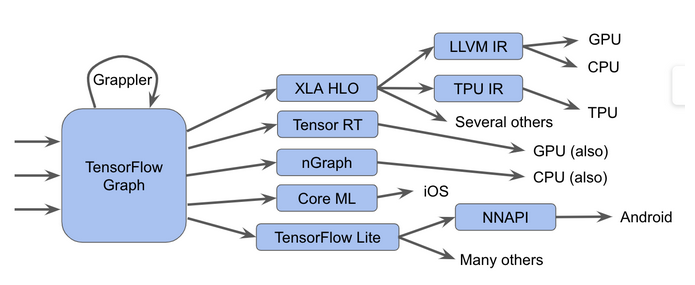

# `MLIR` 简介

## 什么是 `MLIR`

[`MLIR`](https://mlir.llvm.org/) 是一个编译器基础设施 (Compiler Infrastructure), 提供一系列可重用的组件和框架, 用于在不同抽象层次上实现统一的全程序编译分析、优化、代码生成等功能.

简而言之, 旨在解决当前 `Tensorflow` 生态混乱的问题.

`Tensorflow` 中各模块均有自己的优化方法和中间表示( `IR` ), 缺少统一的抽象和优化方法.

`MLIR` 可以通过一种混合的中间表达 `IR` , 实现在一个统一的架构基础上支持多个不同的需求.

详细内容可以参考[MLIR官方文档](https://mlir.llvm.org/docs/)

## `MLIR` 表现形式

## `MLIR` 的扩展 

### 1.自定义方言 `dialect`

#### 1.1 定义方言

#### 1.2 注册方言

### 2.自定义算子 `Op`

#### 1.1 定义算子

#### 1.2 注册算子

上述内容详细可以参考 https://zhuanlan.zhihu.com/p/121673287 

https://zhuanlan.zhihu.com/p/328993481

关于方言 https://zhuanlan.zhihu.com/p/102565792

### 2. 方言间转换

方言间转换称之为 `lowering` . 

一种优化称之为 `pass` .
